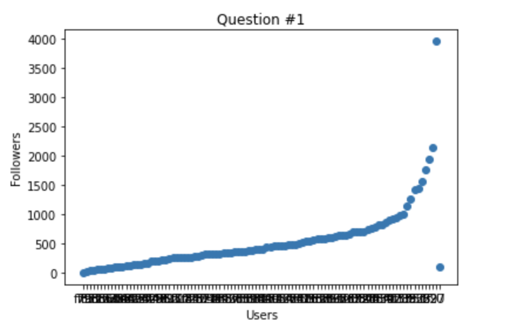
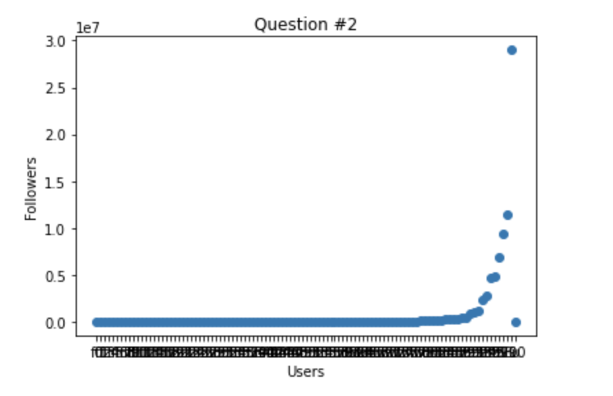

# Homework 4 - Exploring Social Networks
**Due:** Sunday, October 25, 2020 by 11:59pm

## Assignment 

Write a report that answers and explains your answers to the following questions.  *Be sure to include a description of how you answered the questions and any interesting observations you can make based on your analysis.* Your GitHub repo should include all scripts, code, output files, images needed to complete the assignment.

### Q1. Friendship Paradox on Facebook

The [friendship paradox](http://en.wikipedia.org/wiki/Friendship_paradox) says that your friends have more friends than you do.  Determine if the friendship paradox holds for a user's Facebook account. *(This used to be more interesting when you could more easily download your friend's friends data from Facebook.  Facebook now requires each friend to approve this operation, effectively making it impossible.)* 

[HW4-friend-count.csv](HW4-friend-count.csv) contains a user's friends' names and number of friends they each have. 

Compute the mean, standard deviation, and median of the number of friends that the user's friends have.  

Create a graph of the number of friends (y-axis) and the friends (x-axis) themselves, sorted by number of friends (y-axis).  (The friends don't need to be labeled on the x-axis: just f1, f2, f3, ... fn.)  Include the user in the graph (count the number of their friends) and label as U.

#### Q1. Friendship Paradox on Facebook - Answer

[question 1 a code](./question_1_a.ipynb)

The above graph show that the friendship paradox holds for a user's Facebook account. The point in the b ottom right corner is the user. As you can see the user is on the low end of the spectum.

[question 1 b code](./question_1_b.ipynb)

### Q2. Friendship Paradox on Twitter

Determine if the friendship paradox holds for your Twitter account. Since Twitter is a directed graph, use *followers* as the value you measure (i.e., "do your followers have more followers than you?").

Generate the same graph as in Q1, and calcuate the same mean, standard deviation, and median values.

For the Twitter 1.1 API to help gather this data, see:

https://developer.twitter.com/en/docs/accounts-and-users/follow-search-get-users/api-reference/get-followers-list

If you have less than 50 followers on Twitter, then you can use my Twitter account ([weiglemc](https://twitter.com/weiglemc/)).

#### Q2. Friendship Paradox on Twitter - Answer

[question 2 code](./question_2.ipynb)

The above graph show that the friendship paradox holds for a user's Twitter account. The point in the b ottom right corner is the user. As you can see the user is on the low end of the spectum. I am new to twitter so I used weiglemc account. I only use 100 of her followers. A few of her friends have about the same number of followers, but over all most of her followers have more followers than her. 

## Extra Credit

### Q3. (*1 point*) 

Repeat Q2, but change *followers* to *following*.  In other words, are the people you are following following more people than you are?

For the Twitter 1.1 API to help gather this data, see:

https://developer.twitter.com/en/docs/accounts-and-users/follow-search-get-users/api-reference/get-friends-list

## Submission

Make sure that you have committed and pushed your local repo to GitHub.  Your repo should contain any code you developed to answer the questions.  Include "Ready to grade @weiglemc @brutushammerfist" in your final commit message. 

Submit the URL of your *report* in Blackboard:

* Click on HW4 under Assignments in Blackboard
* Under "Assignment Submission", click the "Write Submission" button.
* Copy/paste the URL of your report into the edit box
  * should be something like https<nolink>://github.com/cs432-websci-fall20/hw4-socialmedia-*username*/blob/master/HW4-report.{pdf,md}
* Make sure to "Submit" your assignment.
